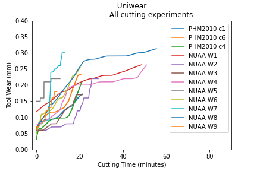

# Katulu-uniwear tidy dataset

A [tidy dataset](https://vita.had.co.nz/papers/tidy-data.pdf) for multi-material 
tool wear dataset suitable for prognostic modelling. 

## Documentation

A detailed documentation is provided under [docs.md](docs.md). We explain
how we generated this multi-material dataset.

## All cutting experiments

A preview of all cutting experiments, tool-wear vs. cutting time.  
. 

## Directories

* [data](data): Contains all bundled datasets.
* [notebooks](notebooks) : Python notebook for plotting.

## License

(c) 2022
Katulu GmbH

This repository and all contributions are licensed under

